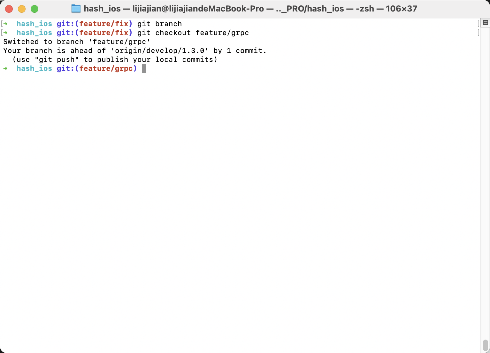

# Oh My Zsh

Oh My Zsh is a delightful, open source, community-driven framework for managing your Zsh configuration. It comes bundled with thousands of helpful functions, helpers, plugins, themes, and a few things that make you shout...

## 解决问题

1. 高亮显示当前分支

    

## 相关技术

* [ohmyz](https://ohmyz.sh)

## 相关操作

1. 安装

    vpn 正常安装

    `/bin/zsh -c "$(curl -fsSL https://raw.github.com/ohmyzsh/ohmyzsh/master/tools/install.sh)"`

2. 卸载

    `uninstall_oh_my_zsh`
